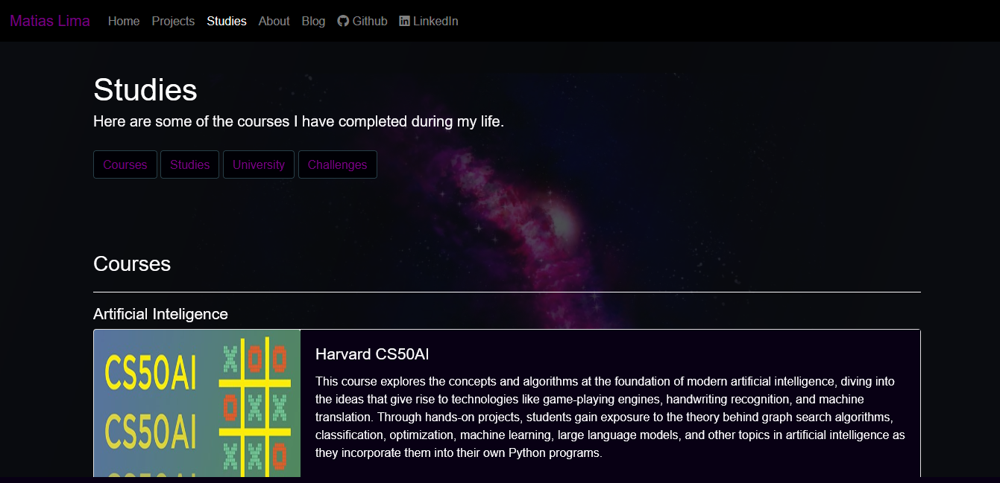
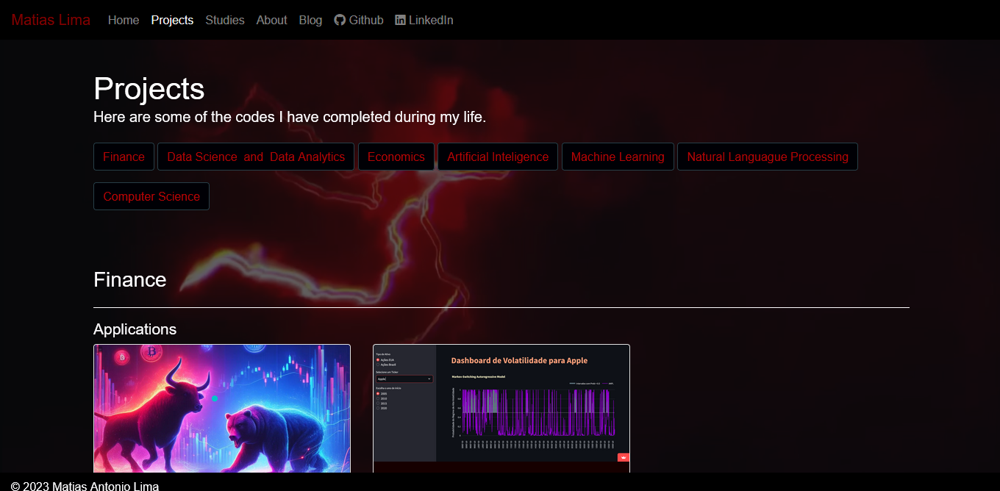
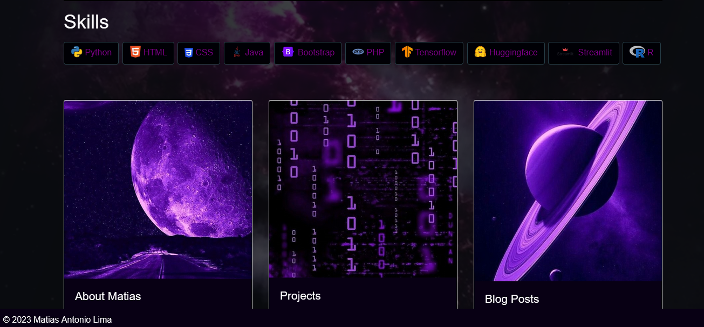

## Hey 👋, I'm Matias Lima!

I am a versatilist and easily adapt to different hats (Full Stack Web Developer 🌐, Economist 📱, ML Engineer 🤖 or beginner level Designer 🎨) depending on what the project requires. I love exploring new tech stack 💻 and leveraging them to build cool stuffs 🛠️. 
 
 
  
### 🧐 More About Me:

- 🌱 &nbsp; I’m currently learning React and Finance; 
- 👨🏻‍💻 &nbsp; Most of my projects are available on [Homepage](https://matias-lima.github.io/)
- 📫 &nbsp; Feel free to ping me on [LinkedIn](https://www.linkedin.com/in/matias-lima-4a667328a)

 

### 🔨 Languages:

### Frameworks:

### Libraries:

  
  

 

## Homepage:

 

 
 

 
 

### 📊 Github Stats
&nbsp;&nbsp;&nbsp;&nbsp;&nbsp;&nbsp;&nbsp;&nbsp;&nbsp;

 
 

 
<b>Visitors Count</b>
  

 
 

